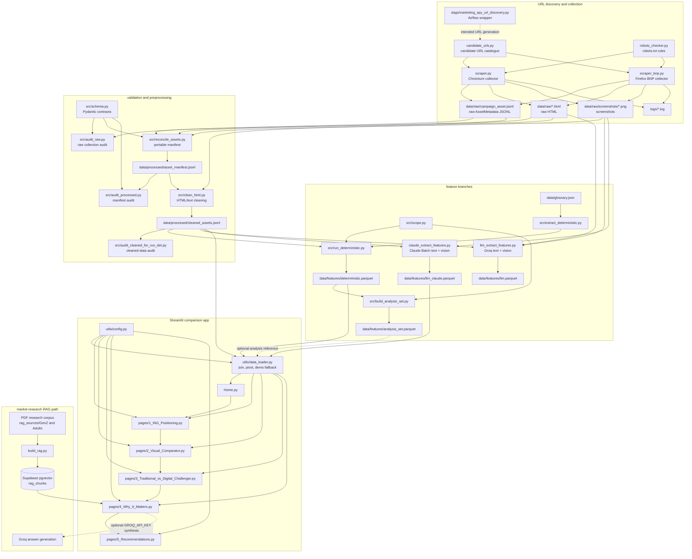

# Data flow and file map

This document describes the repository as it currently exists: a scraping and feature-extraction pipeline feeding a Streamlit comparison app, plus a separate market-research RAG path.

## 1. Data collection

### `candidate_urls.py`
Generated catalogue of candidate web pages, grouped by bank. It is imported by both scrapers and is the source of the URLs that the collection scripts attempt to visit. Each entry contains a URL and a human-readable note. The catalogue includes the five MVP banks (ING, KBC, Belfius, Revolut and N26), configured backup banks (BNP Paribas Fortis and bunq), and additional earlier-corpus banks (Argenta and Beobank).

### `robots_checker.py`
Stores the robots.txt rules and sitemap URLs for the configured banks. It builds `RobotFileParser` instances and exposes `is_allowed()`, which is called by the scrapers before navigation. A URL without a loaded robots configuration is refused rather than scraped by guesswork.

### `scraper.py`
The main Playwright collector. It imports `CANDIDATE_URLS`, applies the robots and domain checks, renders pages in Chromium, dismisses consent banners, waits for real content, and captures three outputs per successful page: raw HTML, a full-page screenshot, and shadow-DOM-aware page text. It validates the metadata with `AssetMetadata` and appends one JSON object per asset to `data/raw/campaign_asset.jsonl`; HTML and screenshots go under `data/raw/` and `data/raw/screenshots/`, and run logs go under `logs/`. BNP Paribas Fortis is intentionally skipped here because Chromium is blocked by Akamai.

### `scraper_bnp.py`
BNP Paribas Fortis-specific equivalent of `scraper.py`. It uses Firefox to work around the BNP Akamai block, while keeping the same robots gate, metadata schema, text extraction, HTML/screenshot artifacts, and `campaign_asset.jsonl` output contract. Its records can therefore be combined with those produced by `scraper.py`.

### `dags/marketing_spy_url_discovery.py`
An Airflow DAG stub scheduled weekly to generate candidate URLs. It calls `marketing_spy.generate_candidate_urls`, a module that is not present in the currently listed repository tree, so this orchestration path is not connected to the checked-in `candidate_urls.py` unless that package is supplied separately.

## 2. Raw-asset validation and normalization

### `src/config.py`
Central path registry for the data pipeline. It defines the project root, raw/processed/features directories, `campaign_asset.jsonl`, screenshots, glossary, documentation, logs, and output locations. Pipeline modules import these constants instead of constructing paths independently.

### `src/schema.py`
Defines the Pydantic data contract. `AssetMetadata` validates one scraped page and its artifact paths; `FeatureRecord` validates one extracted feature value; and `LLMOutput` describes a structured LLM feature response. The scrapers, reconciliation step, audits, and deterministic runner use these models at different points in the pipeline.

### `src/audit_raw.py`
Audits the raw `campaign_asset.jsonl` collection against `AssetMetadata`, checking JSON/schema conformance, bank coverage, screenshot presence, and bank/asset-role coverage. It writes `docs/data_audit.md`. This file replaces the former `audit_jsonl.py`; documentation and commands should refer to `src.audit_raw` (the module's internal legacy run-string still needs alignment in the code itself).

### `src/reconcile_assets.py`
Converts machine-specific scraper metadata into a portable, schema-valid manifest. It reads `data/raw/campaign_asset.jsonl`, resolves HTML and screenshot filenames inside the repository, canonicalizes URLs, generates stable asset IDs, preserves the extracted text, validates each record with `AssetMetadata`, and writes `data/processed/asset_manifest.jsonl`. The raw input is not modified.

### `src/audit_processed.py`
Audits the normalized manifest without changing it. It validates JSON and `AssetMetadata`, checks portable artifact paths and HTML hashes, detects duplicate IDs/URLs/paths and identical HTML, reports scope/language/audience coverage, and writes `docs/asset_manifest_audit.md`. It runs after `reconcile_assets.py` and before cleaning.

## 3. Text preprocessing

### `src/clean_html.py`
Reads `data/processed/asset_manifest.jsonl` and writes `data/processed/cleaned_assets.jsonl`. It prefers substantial text captured live by the scraper (important for ING shadow DOM), otherwise parses saved HTML with BeautifulSoup. It removes scripts, styles, navigation, hidden content, cookie/consent elements and other boilerplate; extracts title/headings/text; records cleaning status and word/character counts; and adds source/text SHA-256 hashes.

### `src/audit_cleaned_for_run_det.py`
Quality gate for `cleaned_assets.jsonl`. It checks JSON parsing, the fields required by deterministic extraction, duplicate asset IDs, language/status distributions, and short text. It writes `docs/cleaned_assets_audit.md`; only after this check is the cleaned file ready for the deterministic runner.

## 4. Feature extraction

### `data/glossary.json`
Frozen English, Dutch and French financial-term lists. `src.extract_deterministic.py` uses the language-specific list to calculate jargon density, so this file is an input to the deterministic feature branch rather than a UI data source.

### `src/extract_deterministic.py`
Reusable implementations of deterministic features: jargon density, mean sentence length using the appropriate spaCy language model, and word count. It loads `data/glossary.json` and is called by `src/run_deterministic.py`.

### `src/run_deterministic.py`
Runs the deterministic branch over `data/processed/cleaned_assets.jsonl`. It creates `FeatureRecord` rows for `jargon_density`, `mean_sentence_length`, and `word_count`, joins asset metadata, derives `scope_role` and `asset_role` using `src.scope.py`, and writes the long-format `data/features/deterministic.parquet`.

### `src/scope.py`
Single source of truth for the POC scope and sampling policy: MVP banks, backup banks, and the target/minimum number of youth records per bank. It is imported by `run_deterministic.py`, `build_analysis_set.py`, and `audit_processed.py`.

### `llm_extract_features.py`
Groq-based LLM/vision extractor. It reads cleaned assets by default, sends page text and screenshots to a vision-capable model, validates the returned feature keys, appends resumable results to `data/features/llm_features_checkpoint.jsonl`, logs failures to `llm_extraction_errors.jsonl`, and consolidates successful records into `data/features/llm.parquet`. It is an alternative LLM branch to the Claude script.

### `claude_extract_features.py`
Claude Batch API version of the LLM/vision branch. It reads `data/processed/cleaned_assets.jsonl`, creates an optional cost estimate, submits resized full-page and initial-viewport screenshots plus text, supports checkpointing and polling, and writes `data/features/llm_claude.parquet`. Batch IDs, custom-ID mappings, checkpoints and errors are stored alongside the feature output.

### `src/build_analysis_set.py`
Builds the smaller, deterministic analysis subset from `data/features/deterministic.parquet`. It keeps MVP youth assets, caps each bank at the configured target, balances selection across languages, writes `data/features/analysis_set.parquet`, and produces `docs/analysis_set_report.md`.

### `build_rag.py`
Separate market-research ingestion pipeline. It reads PDFs from the expected `rag_sources/GenZ/` and `rag_sources/Adults/` directories, extracts and chunks their text, embeds the chunks with Sentence Transformers, and inserts them into a Supabase/Postgres `rag_chunks` pgvector table. Its `search()` function is also a small retrieval test. This path does not consume the bank-page JSONL or Parquet feature files.

## 5. Application and data loading

### `utils/config.py`
Configuration for the Streamlit application: MVP and backup banks, bank types, subject bank, coverage thresholds, and the paths to Claude features, deterministic features, cleaned assets and manual annotations. It is separate from `src/config.py` because it defines app-facing policy and paths.

### `utils/data_loader.py`
Application data access layer. It loads `data/features/llm_claude.parquet`, joins cleaned text/title/screenshot fields from `cleaned_assets.jsonl`, pivots the long deterministic Parquet into a wide per-asset table, and optionally loads `data/features/visual_manual.csv`. If real feature output is unavailable, it creates clearly flagged demo data. It also provides MVP filtering, coverage calculations, scope breakdowns and deterministic-review summaries.

### `Home.py`
Streamlit landing page for scope and methodology. It calls `utils.data_loader.load_features()` and displays coverage, scope roles, review status and out-of-scope rules before linking to the analysis pages.

### `pages/1_ING_Positioning.py`
Computes and displays ING-versus-MVP indicators from the dataframe returned by `utils.data_loader`, including tone, CTA visibility, proposition clarity, explicit audience and eligibility.

### `pages/2_Visual_Comparator.py`
Interactive page-level comparison. It filters the loaded feature dataframe by language/topic, selects up to three banks and pages, displays screenshots/text, and compares visual, LLM and deterministic fields side by side.

### `pages/3_Traditional_vs_Digital_Challenger.py`
Aggregates loaded MVP data by bank type. It presents LLM categorical features, yes/no traits, deterministic writing-style metrics and optional manual visual annotations from `visual_manual.csv`.

### `pages/4_Why_It_Matters.py`
Combines measured MVP data with the RAG corpus. It retrieves relevant chunks from Supabase using the same embedding model as `build_rag.py`, optionally asks Groq to synthesize a grounded answer, and shows the observed data and source passages.

### `pages/5_Recommendations.py`
Displays business recommendations. The current recommendations are placeholders and are not another pipeline transformation; they are intended to be replaced or refined using the findings shown on the other pages and the RAG evidence.

## 6. Supporting documentation and repository assets

- `features_selection.md` defines the feature catalogue, methods and meanings used by the deterministic, LLM and manual branches.
- `docs/data_audit.md`, `docs/asset_manifest_audit.md`, `docs/cleaned_assets_audit.md` and `docs/analysis_set_report.md` are generated audit/build reports, not pipeline inputs.
- `docs/scope.md` records the project scope and methodology used alongside `src/scope.py`.
- `sources/` contains the market-research markdown corpus used as project reference material; `build_rag.py` expects PDF inputs in its separate `rag_sources/` layout.
- `Marketing SPY - How competitors speak to customers.pdf`, `guide-ing-youth-acquisition.md` and `data-scientists-complete-guide-ing-youth-acquisition.md` are reference deliverables/background documents and are not imported by the page-feature pipeline.
- `.streamlit/config.toml` contains Streamlit configuration; `.streamlit/README.md` documents running the app and its expected data files. `.gitignore` and `requirements_backup.txt` are repository/environment support files.
- `utils/__init__.py` and `src/__init__.py` mark the Python packages.
- `data/raw/`, `data/processed/`, `data/features/`, `logs/` and the `dags/marketing_spy/` directory are runtime/organization locations; their generated contents are not all represented in the source tree listing.

## 7. End-to-end flow

## 8. Main execution order

1. Maintain/generate URLs in `candidate_urls.py` (optionally via the Airflow wrapper).
2. Run `scraper.py` and, when needed, `scraper_bnp.py` to create raw JSONL, HTML and screenshots.
3. Run `python -m src.audit_raw`, then `python -m src.reconcile_assets` and `python -m src.audit_processed`.
4. Run `python -m src.clean_html` and `python -m src.audit_cleaned_for_run_det`.
5. Run `python -m src.run_deterministic`; optionally build the analysis set with `python -m src.build_analysis_set`.
6. Run either or both LLM branches (`llm_extract_features.py` or `claude_extract_features.py`) to produce the app's interpretive features.
7. Build the separate RAG store with `build_rag.py` when market-research retrieval is required.
8. Launch the app with `streamlit run Home.py`.
