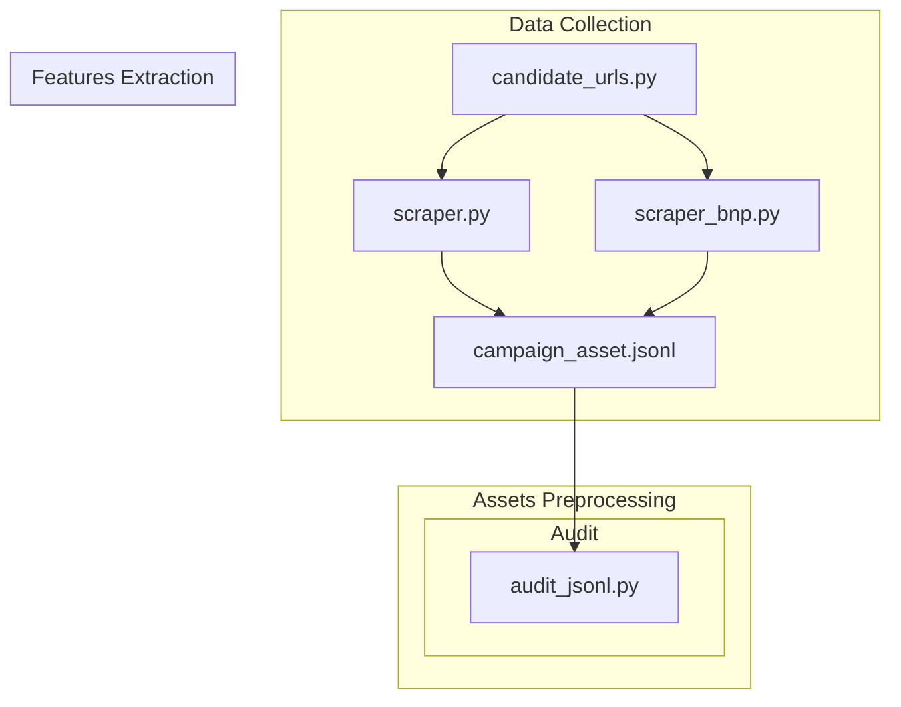

## Data Collection - Victor

### `candidate_urls.py`
Stores the manually curated **list of URLs to scrape**, grouped by bank (plus ing_adult), each pre-checked against robots.txt. Acts as the single source of truth for what gets scraped — no live discovery, fully reproducible.

### `scraper.py`
Automated Playwright **scraper** for ING, KBC, Belfius, and Revolut — navigates each URL, dismisses cookie banners, extracts text, and saves a screenshot, with zero LLM calls. Excludes BNP Fortis, which is blocked by Akamai Bot Manager.

### `scraper_bnp.py` 
A variant of the main **scraper targeting BNP Fortis specifically**, using Firefox instead of Chromium (plus a different viewport/locale) in an attempt to evade the Akamai Bot Manager block we identified earlier.

---

## Features Extraction - Irene

### `schema.py` (src/)
Defines three Pydantic models that serve as the data contract for the pipeline:     
    - AssetMetadata for scraped asset metadata 
    - FeatureRecord for extracted feature values
    - LLMOutput for validating LLM JSON responses. 
These models ensure every piece of data entering the pipeline adheres to a strict format, preventing silent errors and supporting reproducibility as required by ING.

### `glossary.json`
Contains lists of financial terms in English, Dutch, and French, used to compute the jargon_density deterministic feature. It serves as a frozen, language-specific reference so that the same term list is applied consistently across all assets. This ensures reproducibility and fairness when comparing how banks communicate with young adults versus general adults.

### `config.py`
Defines the "contract" of the team: how assets must be defined.

### `audit_jsonl.py`

### `extract_deterministic.py` (src/)

