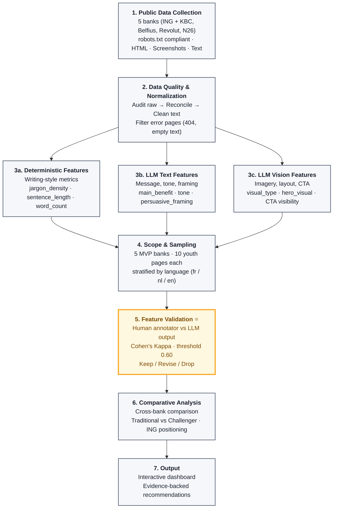

```mermaid
flowchart TD
    A["<b>1. Public Data Collection</b><br/>5 banks (ING + KBC, Belfius, Revolut, N26)<br/>robots.txt compliant · HTML · Screenshots · Text"]
    B["<b>2. Data Quality & Normalization</b><br/>Audit raw → Reconcile → Clean text<br/>Filter error pages (404, empty text)"]
    
    C1["<b>3a. Deterministic Features</b><br/>Writing-style metrics<br/>jargon_density · sentence_length · word_count"]
    C2["<b>3b. LLM Text Features</b><br/>Message, tone, framing<br/>main_benefit · tone · persuasive_framing"]
    C3["<b>3c. LLM Vision Features</b><br/>Imagery, layout, CTA<br/>visual_type · hero_visual · CTA visibility"]
    
    D["<b>4. Scope & Sampling</b><br/>5 MVP banks · 10 youth pages each<br/>stratified by language (fr / nl / en)"]
    E["<b>5. Feature Validation</b> ⭐<br/>Human annotator vs LLM output<br/>Cohen's Kappa · threshold 0.60<br/>Keep / Revise / Drop"]
    F["<b>6. Comparative Analysis</b><br/>Cross-bank comparison<br/>Traditional vs Challenger · ING positioning"]
    G["<b>7. Output</b><br/>Interactive dashboard<br/>Evidence-backed recommendations"]
    
    A --> B
    B --> C1
    B --> C2
    B --> C3
    C1 --> D
    C2 --> D
    C3 --> D
    D --> E
    E --> F
    F --> G
    
    classDef default fill:#f5f7fa,stroke:#4a5568,stroke-width:1.5px,color:#1a202c
    classDef validation fill:#fff8e1,stroke:#f9a825,stroke-width:3px,color:#7c4a00
    class E validation
%% END
```